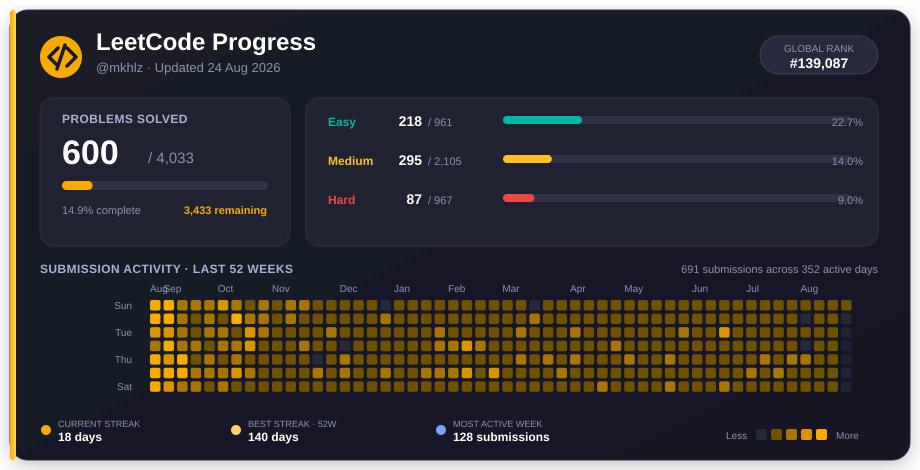

<!-- ====================== HEADER ====================== -->

  
  
  
  
  

---

## About Me

A software and data engineer based in Mumbai, India, with roughly 10 years of experience shipping software and untangling data. These days I also teach the craft as a Senior Instructor, helping career changers and engineers level up.

- A decade of building backends, data pipelines, and web apps that hold up in production
- I care about clean code, pragmatic design, and systems that are easy to reason about
- I teach because explaining a thing well is how you truly understand it
- Recently built child care platforms (CORE and TimeClock) for The Learning Experience
- More about me and my work at [mkhlz.net](https://mkhlz.net)

---

## Tech Stack

**Languages**

**Frameworks and Libraries**

**Data and Cloud**

**DevOps and Tools**

---

## GitHub Analytics

---

## LeetCode

---

## Featured Projects

| Project | Description | Tech |
|---|---|---|
| **[CORE](https://core.mytle.com)** | Child care CRM and operations platform for The Learning Experience. | `Node.js` `React` `jQuery` `pdf-lib` |
| **[TimeClock](https://timeclock.mytle.com)** | Clock in and out system for checking children in and out of care. | `Node.js` `Keycloak` |
| **[mkhlz.net](https://mkhlz.net)** | Personal website, portfolio, and writing. | `Web` |

---

## Let's Connect

I'm open to collaboration, mentoring, and interesting problems. Reach out:

